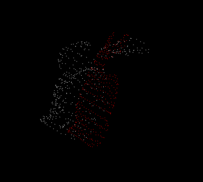

# Как обрабатываалсь карта
## Фильтры
# PassThrough filter
**суть** - remove points whose values fall inside/outside a user given interval along a specified dimension
**реализация на с++**
``` cpp
#include <pcl/filters/passthrough.h>

pcl::PassThrough<pcl::PointXYZ> pass;
pass.setInputCloud (cloud);
//фильтруем по z
pass.setFilterFieldName ("z");
//от и до
pass.setFilterLimits (0.0, 1.0);
pass.filter (*cloud_filtered);
```
# VoxelGrid filter
**суть** - downsample (i.e., reduce the number of points) a Point Cloud. Облако точек делится на кубические ячейки (воксели), и в каждой ячейке вычисляется центр масс. Это позволяет уменьшить количество точек, сохраняя общую структуру облака.

**реализация на с++**

``` cpp
#include <pcl/filters/voxel_grid.h>

  // Create the filtering object
  pcl::VoxelGrid<pcl::PCLPointCloud2> sor;
  sor.setInputCloud (cloud);
  //размеры вокселя, тут 1см
  sor.setLeafSize (0.01f, 0.01f, 0.01f);
  sor.filter (*cloud_filtered);

  ```

# StatisticalOutlierRemoval
**суть**  - remove sparse outliers from noisy data, using StatisticalRemoval. берем k соседних точек, набираем статистику по среднему расстоянию между точками. фильтруем: если для точки расстояние до соседей больше, чем полученное среднее*setStddevMulThresh, то она помечается выбросом 
**реализация на с++**

``` cpp
#include <pcl/filters/statistical_outlier_removal.h>

  // Create the filtering object
  pcl::StatisticalOutlierRemoval<pcl::PointXYZ> sor;
  sor.setInputCloud (cloud);
//   The number of neighbors to analyze for each point is set to 50
  sor.setMeanK (50);
//   standard deviation multiplier to 1
// all points who have a distance larger than 1 standard deviation
//  of the mean distance to the query point will be marked as outliers and removed
  sor.setStddevMulThresh (1.0);
  sor.filter (*cloud_filtered);
  // отфильтрованное облако
  sor.filter (*cloud_filtered); 
  //получение удаленных точек во время фильтрации
  sor.setNegative (true);
  sor.filter (*cloud_filtered);

  ```

  **результаты** - было 1549128 points, стало 14893384 points, те удалено 13344256 points при параметрах: 200 соседних точек, на 1 единице длины. размер исходный - 215475280 байт (~206 Mb), отфильтрованный - 193146704 байт (~184 Mb) 

# RadiusOutlierRemoval
**суть** - удаляет точки, которые не имеют достаточного числа соседей в заданном радиусе. 
**реализация на с++**
``` cpp
pcl::RadiusOutlierRemoval<pcl::PointXYZ> ror;
ror.setInputCloud(cloud);
ror.setRadiusSearch(0.8);  // Радиус поиска соседей
ror.setMinNeighborsInRadius(5);  // Минимум 5 соседей для каждой точки
ror.filter(*cloud_filtered);
```
# ConditionalRemoval
**суть** - removes all indices in the given input cloud that do not satisfy one or more given conditions
# Projecting points using a parametric model
**суть** - project points onto a parametric model (e.g., plane, sphere, etc). The parametric model is given through a set of coefficients – in the case of a plane, through its equation: ax + by + cz + d = 0.
**реализация на с++**
``` cpp
    // Create a set of planar coefficients with X=Y=0,Z=1
    pcl::ModelCoefficients::Ptr coefficients(new pcl::ModelCoefficients());
    coefficients->values.resize(4);
    coefficients->values[0] = coefficients->values[1] = 0;
    coefficients->values[2] = 1.0;
    coefficients->values[3] = 0;

    // Create the filtering object
    pcl::ProjectInliers<pcl::PointXYZ> proj;
    proj.setModelType(pcl::SACMODEL_PLANE);
    proj.setInputCloud(cloud);
    proj.setModelCoefficients(coefficients);
    proj.filter(*cloud_projected);

  ```



## Сжатие
В PCD есть стандартный способ сжатия данных с использованием формата "binary_compressed", pcl::io::savePCDFileBinaryCompressed может автоматически сжать и записать данные в соответствующем формате, что и делает функция compress_pcd_file. Результаты: исходный файл - 523863357 байт (примерно 500 мб), сжатый файл - 215475280 байт (примерно 206 мб). 
обычный файл - [done, 10821.2 ms : 14893384 points], сжатый файл - [done, 1164.39 ms : 14893384 points]. то есть разница в скорости открытия почти 10 раз. 